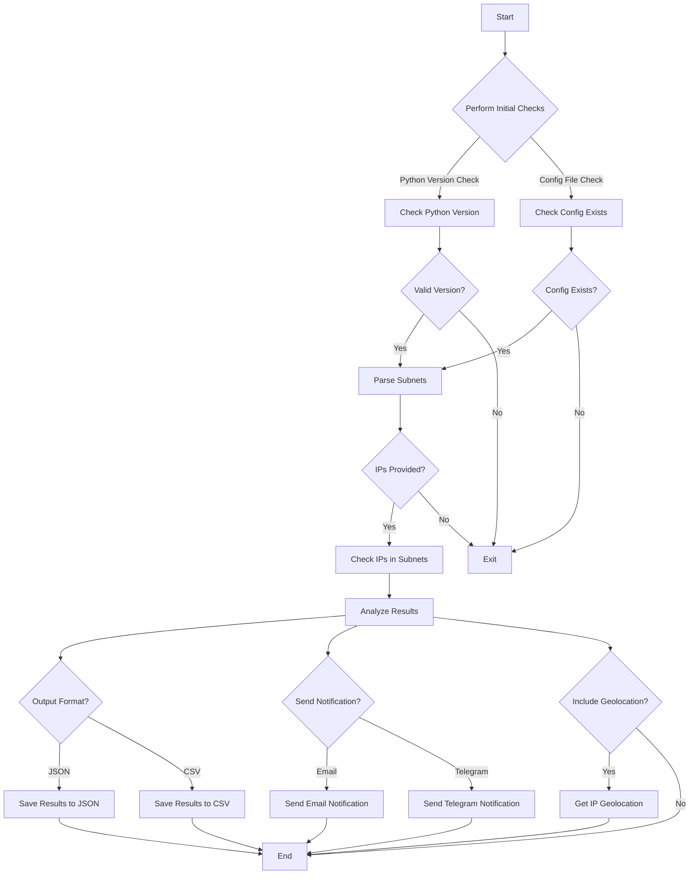

# Subnet Searcher

## Overview

**Subnet Searcher** is a Python script designed to check if a list of IP addresses belongs to specified subnets. It supports reading IPs from a file or command-line arguments, and it can output results in JSON or CSV format. Additionally, it can send notification emails with the results and include geolocation information for the IPs.

## Features

- Validate IP addresses against specified subnets.
- Read IP addresses from a file (supports CSV with a specified column).
- Output results in JSON or CSV format.
- Send notification Emails,Telegram with the results.
- Include geolocation information for IP addresses.
- Perform initial checks for Python version and configuration file.
- Multithreaded processing for faster execution.

## Requirements

- Python 3.7 or higher
- Required Python packages (install via `pip`):
  - `ipaddress`
  - `python-dotenv`
  - `requests`
  - `smtplib`
  - `email`
  - `argparse`
  - `csv`
  - `json`
  - `concurrent.futures`
  - `logging`
  - `queue`
  - `collections`

## Installation

1. Clone the repository or download the script.
2. Install the required Python packages:
   ```sh
   pip install -r requirements.txt
   ```
3. Create a `.env` file in the same directory as the script with the following variables:
   ```env
   SUBNETS=name1:cidr1;cidr2,name2:cidr3;cidr4
   EMAIL_SENDER=your_email@example.com
   EMAIL_PASSWORD=your_email_password
   SMTP_SERVER=smtp.example.com
   SMTP_PORT=587
   TELEGRAM_BOT_TOKEN=
   TELEGRAM_CHAT_ID=
   ```

## Usage

### Command-Line Arguments

- `ips`: List of IPs to check.
- `--file`: File containing IPs to check.
- `--column`: Column name in CSV file containing IPs.
- `--subnet`: Name of the subnet to check against.
- `--psubs`: Print the configured subnets.
- `--ip`: Single IP to check.
- `--output`: Output format for results (`json` or `csv`).
- `--email`: Email address to send the results.
- `--geolocation`: Include geolocation information for IPs.
- `--telegram`: Send Result to Telegram

### Examples

1. Check a single IP:
   ```sh
   python subnet_searcher.py --ip 192.168.1.1
   ```

2. Check multiple IPs from a file:
   ```sh
   python subnet_searcher.py --file ips.txt
   ```

3. Check IPs from a CSV file with a specific column:
   ```sh
   python subnet_searcher.py --file ips.csv --column ip_address
   ```

4. Output results in JSON format:
   ```sh
   python subnet_searcher.py --file ips.txt --output json
   ```

5. Send results via email:
   ```sh
   python subnet_searcher.py --file ips.txt --email recipient@example.com
   ```
6. Send results via email:
   ```sh
   python subnet_searcher.py --file ips.txt --telegram
   ```

7. Include geolocation information:
   ```sh
   python subnet_searcher.py --file ips.txt --geolocation
   ```


## Code Flow 

## Logging

The script uses Python's `logging` module to log information, errors, and execution time. Logs are printed to the console.

## Author

**Aly Emara**

## License

This project is licensed under the MIT License.
